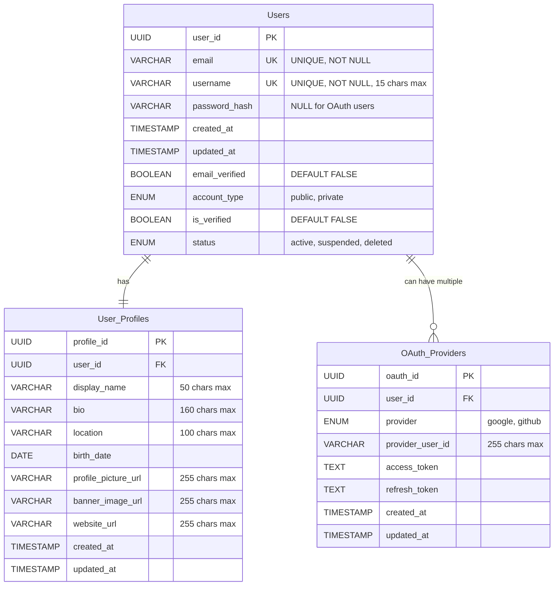

# User Service ERD

## Entity Relationship Diagram for User Service

This diagram shows the database schema for the User Service, which handles user management, authentication, and profiles.

## Table Descriptions

### Users

Core user account information including authentication credentials and account settings.

### User_Profiles

Extended profile information that users can customize, including bio, images, and personal details.

### OAuth_Providers

Stores OAuth authentication tokens and provider-specific user IDs for third-party login integration.

## Key Relationships

- Each User has exactly one Profile (one-to-one)
- Each User can have multiple OAuth Providers (one-to-many)